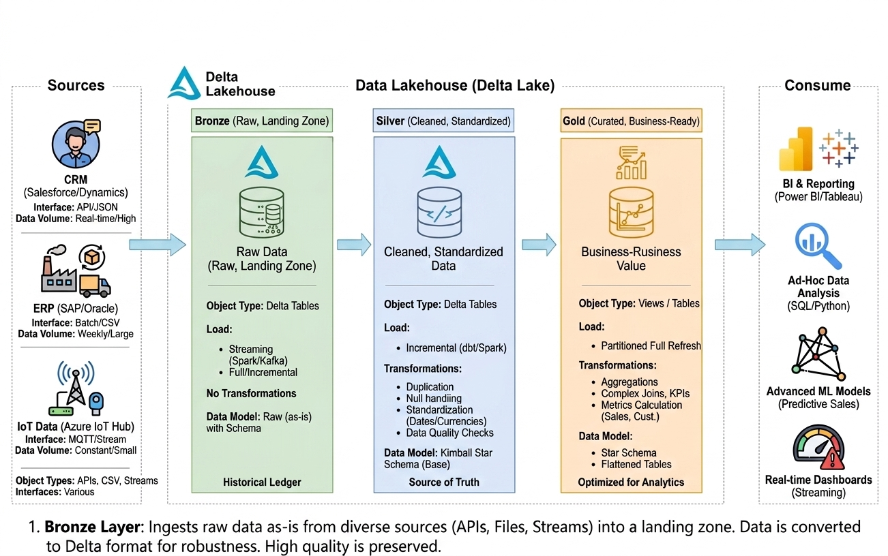

# SQL Data Warehouse for Analytical Project

Welcome to my data warehouse analytics project repository! This project demonstrates a comprehensive data warehousing and analytics solution, from building the core warehouse architecture to generating actionable insights and driving data-driven decisions.

-----
# Data Architecture
The data architecture for this project follows Medallion Architecture **Bronze**, **Silver**, and **Gold** layers:

1. **Bronze Layer**: Stores raw data as-is from the source systems. Data is ingested from CSV Files into SQL Server Database.
2. **Silver Layer**: This layer includes data cleansing, standardization, and normalization processes to prepare data for analysis.
3. **Gold Layer**: Houses business-ready data modeled into a star schema required for reporting and analytics.

---

## 🛡️ License

This project is licensed under the [MIT License](LICENSE). You are free to use, modify, and share this project with proper attribution.
